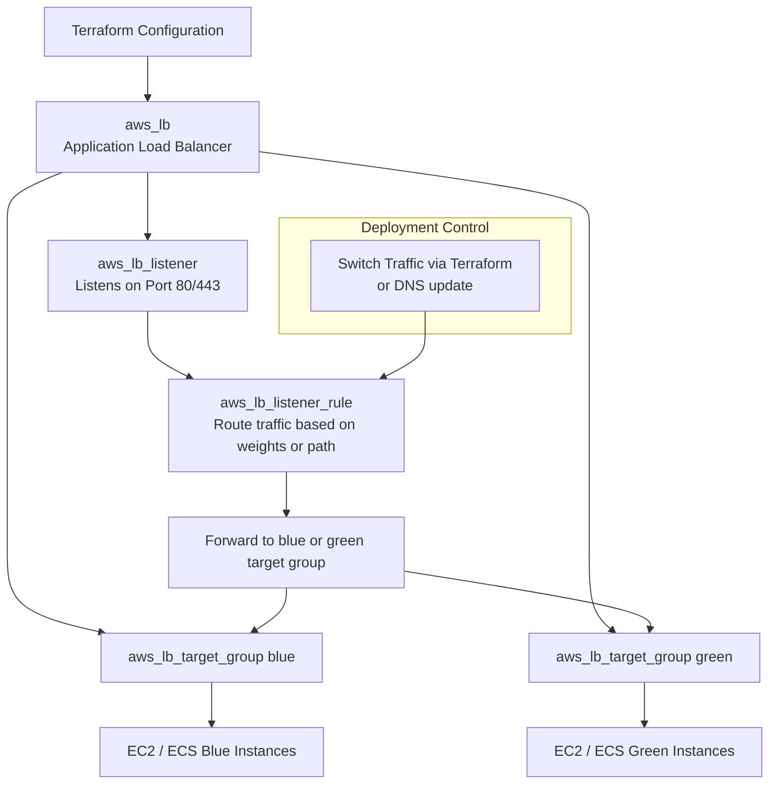

```mermaid
graph TD;
    A[Terraform Configuration] --> B[aws_lb<br>Application Load Balancer]

    B --> C1[aws_lb_target_group blue]
    B --> C2[aws_lb_target_group green]

    C1 --> D1[EC2 / ECS Blue Instances]
    C2 --> D2[EC2 / ECS Green Instances]

    B --> E[aws_lb_listener<br>Listens on Port 80/443]
    E --> F[aws_lb_listener_rule<br>Route traffic based on weights or path]

    F --> G1[Forward to blue or green target group]

    G1 --> C1
    G1 --> C2

    subgraph "Deployment Control"
        H[Switch Traffic via Terraform<br>or DNS update]
    end

    H --> F

```